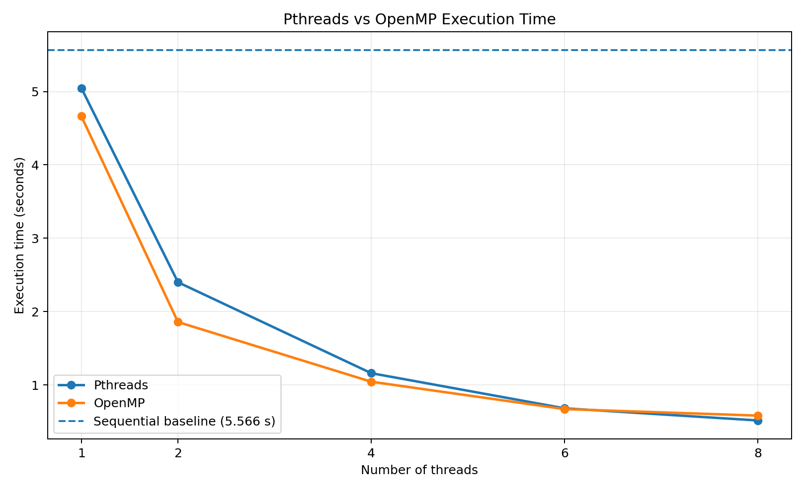
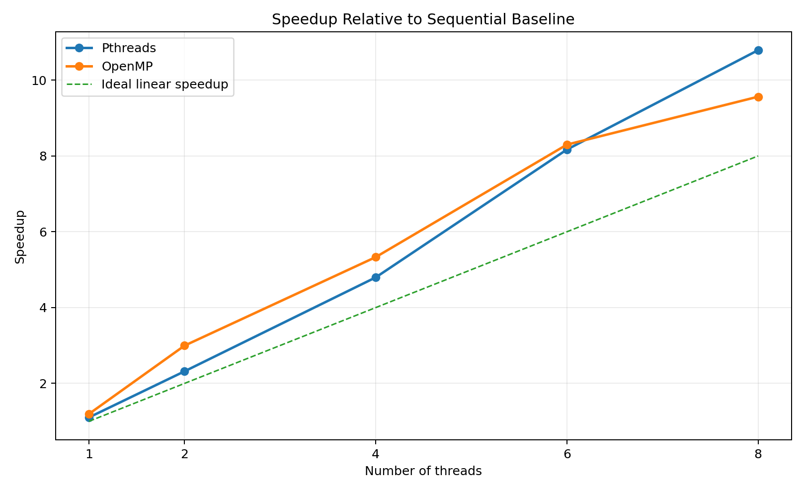
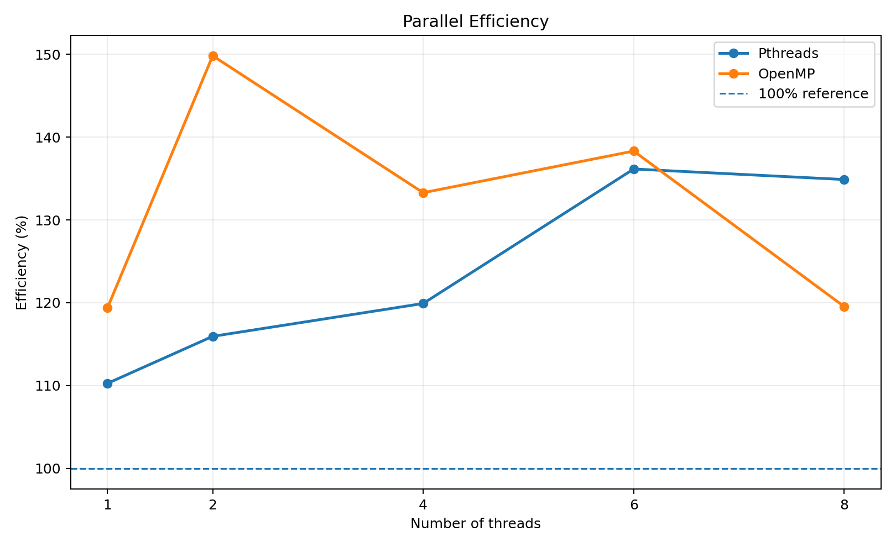

# PGC Experiment 2

## Multithreaded Programming Using Pthreads and OpenMP

---

## 📌 Experiment Overview

This experiment demonstrates multithreaded programming using POSIX Threads (Pthreads) and OpenMP.

The experiment covers thread creation, multiple-thread execution, work distribution, race conditions, synchronization, barriers, and performance analysis.

The programs were developed and tested using Ubuntu 24.04.4 LTS on WSL2 with GCC.

---

## 🎯 Objectives

- Understand thread creation and management using Pthreads.
- Create and execute multiple threads.
- Distribute work among multiple threads.
- Demonstrate race conditions.
- Apply mutex synchronization.
- Implement parallel programs using OpenMP.
- Demonstrate OpenMP work sharing.
- Use critical sections for synchronization.
- Use barriers for thread coordination.
- Measure execution time with different thread counts.
- Calculate speedup and parallel efficiency.
- Compare Pthreads and OpenMP performance.

---

## 🛠️ Technologies Used

| Component | Details |
|---|---|
| Operating System | Ubuntu 24.04.4 LTS |
| Platform | WSL2 |
| Language | C |
| Compiler | GCC |
| Threading API | POSIX Threads (Pthreads) |
| Parallel Programming API | OpenMP |
| Editor | Nano |

---

# 🔄 Experiment Workflow

```mermaid
flowchart TD
    A["Start"] --> B["Pthreads"]
    A --> C["OpenMP"]

    B --> B1["Thread Creation"]
    B1 --> B2["Multiple Threads"]
    B2 --> B3["Work Distribution"]
    B3 --> B4["Race Condition"]
    B4 --> B5["Mutex Synchronization"]

    C --> C1["Parallel Region"]
    C1 --> C2["Work Sharing"]
    C2 --> C3["Race Condition"]
    C3 --> C4["Critical Section"]
    C4 --> C5["Barrier Synchronization"]

    B5 --> D["Performance Evaluation"]
    C5 --> D

    D --> E["Execution Time"]
    E --> F["Speedup"]
    F --> G["Efficiency"]
    G --> H["Analysis and Conclusion"]
    ---

# 🧵 Pthreads

Pthreads provides explicit control over thread creation, execution, joining, and synchronization.

## Programs Implemented

| Program | Description |
|---|---|
| `thread1.c` | Basic thread creation |
| `thread2.c` | Multiple thread creation and execution |
| `thread_sum.c` | Work distribution among threads |
| `race.c` | Race-condition demonstration |
| `mutex.c` | Synchronization using mutex |

## Pthreads Execution Flow

```mermaid
flowchart LR
    A["Main Thread"] --> B["Create Threads"]
    B --> C["Assign Work"]
    C --> D["Parallel Execution"]
    D --> E["Join Threads"]
    E --> F["Final Result"]
## Pthreads Results

| Experiment | Expected | Actual |
|---|---:|---:|
| Work Distribution | 360 | 360 |
| Race Condition | 400000 | 358302 |
| Mutex Synchronization | 400000 | 400000 |

The race-condition experiment demonstrates incorrect results caused by unsynchronized access to shared data.

The mutex implementation protects the shared resource and produces the expected result.

---

# OpenMP

OpenMP provides a higher-level approach to shared-memory parallel programming using compiler directives and runtime support.

## Programs Implemented

| Program | Description |
|---|---|
| omp1.c | Basic OpenMP parallel region |
| omp_sum.c | Parallel work distribution |
| omp_race.c | Race-condition demonstration |
| omp_critical.c | Synchronization using critical section |
| omp_barrier.c | Thread synchronization using barrier |
## OpenMP Execution Flow

```mermaid
flowchart LR
    A["Sequential Program"] --> B["Parallel Region"]
    B --> C["Multiple Threads"]
    C --> D["Work Sharing"]
    D --> E["Synchronization"]
    E --> F["Combined Result"]
## OpenMP Results

| Experiment | Expected | Actual |
|---|---:|---:|
| Work Distribution | 360 | 360 |
| Race Condition | 400000 | 100387 |
| Critical Section | 400000 | 400000 |
| Barrier | Stage 1 before Stage 2 | Correct |

---

# Synchronization

The experiment demonstrates why synchronization is required when multiple threads access shared data.
```mermaid
flowchart TD
    A["Multiple Threads"] --> B["Shared Resource"]
    B --> C{"Synchronization"}

    C -->|"No"| D["Race Condition"]
    D --> E["Incorrect Result"]

    C -->|"Mutex / Critical"| F["Protected Access"]
    F --> G["Correct Result"]

    H["Barrier"] --> I["Threads Wait"]
    I --> J["Next Stage Begins"]
---

# Performance Evaluation

Performance was measured using:

- Sequential execution
- Pthreads with 1, 2, 4, 6 and 8 threads
- OpenMP with 1, 2, 4, 6 and 8 threads

## Sequential Baseline

**5.565676 seconds**

## Measured Execution Times

| Threads | Pthreads | OpenMP |
|---:|---:|---:|
| 1 | 5.047552 s | 4.662678 s |
| 2 | 2.400156 s | 1.857468 s |
| 4 | 1.160360 s | 1.043935 s |
| 6 | 0.681312 s | 0.670657 s |
| 8 | 0.515806 s | 0.582004 s |
---

## Execution Time Comparison



The execution time decreases as the number of threads increases for both Pthreads and OpenMP in the measured workload.

---

## Speedup Analysis

Speedup is calculated using:

**Speedup = Sequential Execution Time / Parallel Execution Time**



The graph compares the measured speedup with ideal linear scaling.

---

## Parallel Efficiency

Efficiency is calculated using:

**Efficiency = Speedup / Number of Threads × 100**



> **Note:** Some measured efficiency values exceed 100% because the separately compiled sequential baseline was slower than the one-thread Pthreads/OpenMP implementations in the WSL2 environment. These values represent the measured benchmark results for this experimental setup.
---

# Performance Analysis Flow

```mermaid
flowchart LR
    A["Sequential Baseline"] --> B["Parallel Execution"]
    B --> C["Measure Execution Time"]
    C --> D["Calculate Speedup"]
    D --> E["Calculate Efficiency"]
    E --> F["Compare Results"]

---

# Key Observations

### Thread Creation

Both Pthreads and OpenMP successfully created and executed multiple threads.

### Work Distribution

The work-distribution programs produced the expected total:

**360**

### Race Conditions

Unsynchronized shared-data access produced incorrect results:

- Pthreads: **358302 instead of 400000**
- OpenMP: **100387 instead of 400000**

### Synchronization

Synchronization restored the expected result:

- Pthreads mutex: **400000**
- OpenMP critical section: **400000**

### Barrier

The OpenMP barrier ensured that Stage 1 completed before Stage 2 began.

### Performance

Increasing the number of threads substantially reduced execution time for the measured workload.
# Pthreads vs OpenMP

| Feature | Pthreads | OpenMP |
|---|---|---|
| Thread Management | Explicit | Runtime managed |
| Thread Creation | `pthread_create()` | OpenMP directives |
| Synchronization | Mutex | Critical / Barrier |
| Work Distribution | Programmer controlled | OpenMP constructs |
| Control | Fine-grained | Higher-level |
| Programming Complexity | Higher | Lower |

The experiment demonstrates two different approaches to shared-memory parallel programming.
# Experimental Evidence

The repository includes terminal screenshots showing the actual execution and output of the major experiments.

The evidence covers:

1. Pthreads multiple-thread execution
2. Pthreads work distribution
3. Pthreads race condition
4. Pthreads mutex synchronization
5. OpenMP parallel execution
6. OpenMP race condition and critical section
7. OpenMP barrier synchronization
8. Performance measurements

The screenshots provide execution evidence corresponding to the programs and results presented in this README.
# Compilation

## Pthreads

```bash
gcc pthreads/thread1.c -o pthreads/thread1 -pthread
gcc pthreads/thread2.c -o pthreads/thread2 -pthread
gcc pthreads/thread_sum.c -o pthreads/thread_sum -pthread
gcc pthreads/race.c -o pthreads/race -pthread
gcc pthreads/mutex.c -o pthreads/mutex -pthread

## OpenMP

gcc openmp/omp1.c -o openmp/omp1 -fopenmp
gcc openmp/omp_sum.c -o openmp/omp_sum -fopenmp
gcc openmp/omp_race.c -o openmp/omp_race -fopenmp
gcc openmp/omp_critical.c -o openmp/omp_critical -fopenmp
gcc openmp/omp_barrier.c -o openmp/omp_barrier -fopenmp

# Execution

## Pthreads

```bash
./pthreads/thread1
./pthreads/thread2
./pthreads/thread_sum
./pthreads/race
./pthreads/mutex

## OpenMP

```bash
./openmp/omp1
./openmp/omp_sum
./openmp/omp_race
./openmp/omp_critical
./openmp/omp_barrier
# Conclusion

This experiment provided practical implementation of multithreaded programming using **Pthreads and OpenMP**.

The experiment demonstrated:

- Thread creation
- Multiple-thread execution
- Work distribution
- Race conditions
- Mutex synchronization
- OpenMP parallel regions
- Critical sections
- Barrier synchronization
- Execution-time measurement
- Speedup analysis
- Parallel efficiency

The synchronization experiments demonstrated the importance of protecting shared data, while the performance measurements demonstrated the effect of increasing the number of threads on execution time.

Overall, the experiment provides practical understanding of **parallel execution, synchronization, coordination, and performance analysis in shared-memory multithreaded programming**.

---

## PGC Experiment 2

**Multithreaded Programming Using Pthreads and OpenMP**

**Source Code • Results • Graphs • Experimental Evidence**
